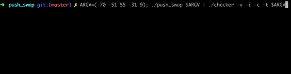

# push_swap

For this project I needed sort data on a stack, with a limited set of instructions, using
the lowest possible number of actions. To succeed I had to manipulate various
types of algorithms and choose the one (of many) most appropriate solution for an
optimized data sorting

